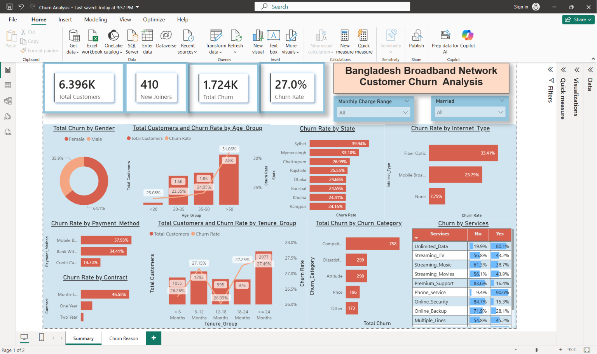
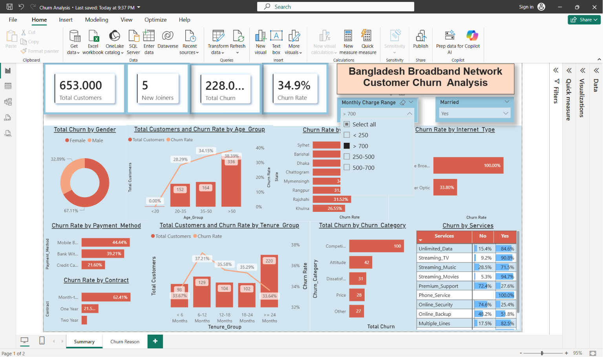
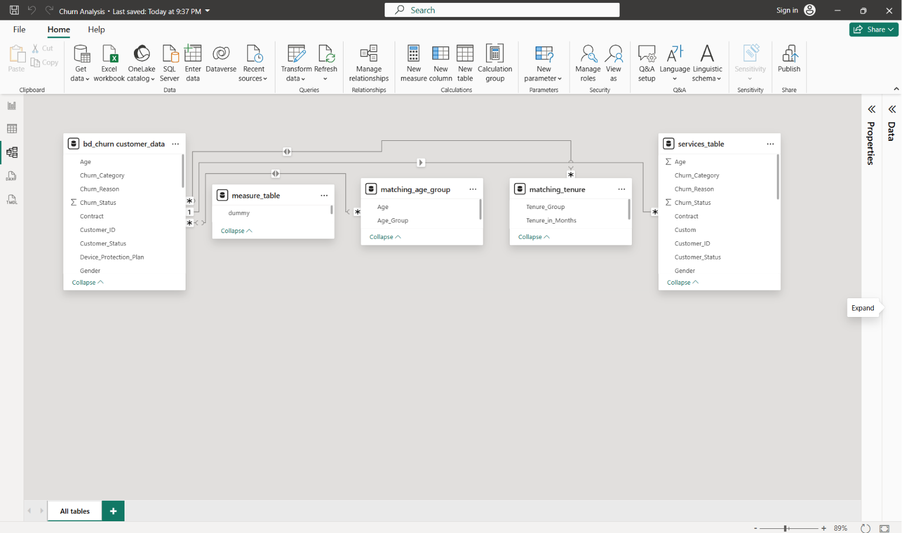

# Bangladesh Telecom Customer Churn Analysis

> End-to-end data analytics and machine learning project that explores customer churn in the Bangladesh telecom market — from raw data cleaning to interactive Power BI dashboards and multi-model churn prediction (Logistic Regression, Random Forest, Gradient Boosting, XGBoost).

---

## Table of Contents

- [Project Overview](#project-overview)
- [Key Highlights](#key-highlights)
- [Tech Stack](#tech-stack)
- [Project Architecture](#project-architecture)
- [Folder Structure](#folder-structure)
- [Dataset](#dataset)
- [Getting Started](#getting-started)
  - [Prerequisites](#prerequisites)
  - [1. Clone the Repository](#1-clone-the-repository)
  - [2. Set Up MySQL Database](#2-set-up-mysql-database)
  - [3. Run the Power BI Dashboard](#3-run-the-power-bi-dashboard)
  - [4. Run the Churn Prediction Notebook](#4-run-the-churn-prediction-notebook)
- [Pipeline Walkthrough](#pipeline-walkthrough)
  - [Phase 1 — Data Preprocessing (Python)](#phase-1--data-preprocessing-python)
  - [Phase 2 — Database & Exploration (SQL)](#phase-2--database--exploration-sql)
  - [Phase 3 — Dashboard (Power BI)](#phase-3--dashboard-power-bi)
  - [Phase 4 — Multi-Model Churn Prediction (Jupyter Notebook)](#phase-4--multi-model-churn-prediction-jupyter-notebook)
- [Dashboard Pages](#dashboard-pages)
- [Key Findings](#key-findings)
- [License](#license)

---

## Project Overview

Customer churn is one of the biggest challenges in the telecom industry. This project analyzes **6,418 customer records** from a telecom company operating across all **8 administrative divisions of Bangladesh** to:

1. Explore churn patterns through SQL queries and Power BI visualizations.
2. Identify the key drivers of churn (contract type, tenure, internet service, etc.).
3. Predict which newly-joined customers are most likely to churn by comparing **four ML models** and selecting the best performer.

The entire workflow — from raw CSV to clean data to MySQL database to Power BI dashboard to ML predictions — is fully reproducible.

---

## Key Highlights

| Aspect | Detail |
|---|---|
| **Records** | 6,418 customers |
| **Features** | 32 columns (demographics, services, billing, churn) |
| **Geographic Scope** | 8 Bangladesh divisions (Dhaka, Chattogram, Khulna, Rajshahi, Rangpur, Sylhet, Barishal, Mymensingh) |
| **Churn Rate** | ~27% (1,732 out of 6,418) |
| **Currency** | Bangladeshi Taka (BDT) |
| **ML Models** | Logistic Regression, Random Forest, Gradient Boosting, XGBoost |
| **Visualization** | Interactive Power BI report (`.pbix`) |
| **Missing Values** | 0 — all 26,052 original blanks imputed |

---

## Tech Stack

| Layer | Technology | Purpose |
|---|---|---|
| **Data Storage** | MySQL | Database for customer data, views, and queries |
| **Data Cleaning** | Python (csv module) | Missing value imputation & data preprocessing |
| **Data Exploration** | SQL (MySQL) | Distribution analysis, null checks, revenue breakdowns |
| **Visualization** | Power BI Desktop | Interactive dashboards with DAX measures & Power Query |
| **Machine Learning** | Python (scikit-learn, XGBoost) | Multi-model churn prediction (Jupyter Notebook) |

---

## Project Architecture

```
+----------------+     +----------------+     +----------------+     +----------------+
|   Raw CSV      |---->|  Python        |---->|   MySQL        |---->|  Power BI      |
|  (6,418 rows)  |     |  Cleaning      |     |  Database      |     |  Dashboard     |
|                |     |  Scripts       |     |  + SQL Views   |     |  (.pbix)       |
+----------------+     +----------------+     +----------------+     +-------+--------+
                                                    |                        |
                                                    |   +--------------+     |
                                                    +-->|  Python ML   |<----+
                                                        | (4 Models)   |
                                                        |  Notebook    |
                                                        +--------------+
```

---

## Folder Structure

```
bd_networking_churn/
|
|-- README.md                              # This file
|-- Churn Analysis.pbix                    # Power BI dashboard file
|
+-- Data & Resources/
    |
    |-- Data/
    |   |-- Customer_Data.csv              # Clean dataset (6,418 records, 0 missing values)
    |   |-- Dataset_Description.md         # Full column descriptions & distributions
    |   |-- Dataset_Changes.md             # Detailed changelog (India -> Bangladesh adaptation)
    |   |-- Data_Preprocessing_Steps.md    # Step-by-step preprocessing documentation
    |   |-- fix_missing_values.py          # Script to impute all 26,052 missing values
    |   +-- stats.py                       # Quick descriptive stats (age, tenure)
    |
    |-- SQL Queries/
    |   |-- 01_gender_distribution.sql     # Gender breakdown with percentages
    |   |-- 02_contract_distribution.sql   # Contract type distribution
    |   |-- 03_customer_status_revenue.sql # Revenue by customer status (Stayed/Churned/Joined)
    |   |-- 04_state_distribution.sql      # Division-wise customer distribution
    |   |-- 05_check_nulls.sql             # Null check across all 32 columns
    |   |-- 06_insert_prod_data.sql        # Create production table with IFNULL defaults
    |   |-- 07_create_vw_ChurnData.sql     # View: Churned + Stayed customers (for training)
    |   +-- 08_create_vw_JoinData.sql      # View: Joined customers (for prediction)
    |
    |-- DAX & Power Query/
    |   |-- 01_power_query_transformations.m   # Power Query M code (bins, groups, unpivot)
    |   +-- 02_dax_measures.dax                # DAX measures (churn rate, total customers, etc.)
    |
    +-- Python Scripts/
        |-- 02_churn_prediction_all_models.ipynb    # Multi-model prediction notebook
        +-- Outputs/                                # Auto-generated by the notebook
            |-- 01_target_distribution.png
            |-- 02_churn_by_contract.png
            |-- 03_churn_by_tenure.png
            |-- 04_monthly_charge_distribution.png
            |-- 05_correlation_heatmap.png
            |-- 06_confusion_matrices.png
            |-- 07_roc_curves.png
            |-- 08_model_comparison.png
            |-- 09_feature_importance.png
            |-- 10_prediction_results.png
            +-- Predicted_Churners.csv
```

---

## Dataset

The dataset contains **6,418 customer records** with **32 features** covering:

| Category | Columns | Examples |
|---|---|---|
| **Customer Info** | 7 | `Customer_ID`, `Gender`, `Age`, `Married`, `State`, `Number_of_Referrals`, `Tenure_in_Months` |
| **Service Details** | 12 | `Internet_Type`, `Phone_Service`, `Streaming_TV`, `Online_Security`, `Unlimited_Data`, ... |
| **Billing & Contract** | 8 | `Contract`, `Payment_Method`, `Monthly_Charge`, `Total_Revenue`, ... |
| **Target / Churn** | 3 | `Customer_Status` (Stayed / Churned / Joined), `Churn_Category`, `Churn_Reason` |

### Customer Status Distribution

| Status | Count | % |
|---|---|---|
| Stayed | 4,275 | 66.6% |
| **Churned** | **1,732** | **27.0%** |
| Joined | 411 | 6.4% |

### Division Breakdown

| Division | Records | % |
|---|---|---|
| Dhaka | 1,260 | 19.6% |
| Khulna | 1,111 | 17.3% |
| Rajshahi | 876 | 13.6% |
| Chattogram | 817 | 12.7% |
| Barishal | 740 | 11.5% |
| Sylhet | 667 | 10.4% |
| Rangpur | 656 | 10.2% |
| Mymensingh | 291 | 4.5% |

> **Note:** All monetary values are in **Bangladeshi Taka (BDT)**. Payment methods include `Mobile Banking (bKash/Nagad)` reflecting Bangladesh's digital payment landscape.

For full column descriptions, see [`Dataset_Description.md`](Data%20%26%20Resources/Data/Dataset_Description.md).

---

## Getting Started

### Prerequisites

Make sure you have the following installed:

| Tool | Version | Purpose |
|---|---|---|
| [MySQL Server](https://dev.mysql.com/downloads/mysql/) | 8.0+ | Database engine |
| [MySQL Workbench](https://dev.mysql.com/downloads/workbench/) (optional) | Latest | GUI for running SQL queries |
| [Python](https://www.python.org/downloads/) | 3.8+ | Data cleaning & ML model |
| [Power BI Desktop](https://powerbi.microsoft.com/en-us/desktop/) | Latest | Dashboard visualization |

### 1. Clone the Repository

```bash
git clone https://github.com/your-username/bd_networking_churn.git
cd bd_networking_churn
```

### 2. Set Up MySQL Database

#### a) Create the database and import data

```sql
-- Create the schema
CREATE SCHEMA IF NOT EXISTS bd_churn;

-- Create the table
CREATE TABLE bd_churn.customer_data (
    Customer_ID VARCHAR(20),
    Gender VARCHAR(10),
    Age INT,
    Married VARCHAR(5),
    State VARCHAR(30),
    Number_of_Referrals INT,
    Tenure_in_Months INT,
    Value_Deal VARCHAR(20),
    Phone_Service VARCHAR(5),
    Multiple_Lines VARCHAR(5),
    Internet_Service VARCHAR(5),
    Internet_Type VARCHAR(30),
    Online_Security VARCHAR(5),
    Online_Backup VARCHAR(5),
    Device_Protection_Plan VARCHAR(5),
    Premium_Support VARCHAR(5),
    Streaming_TV VARCHAR(5),
    Streaming_Movies VARCHAR(5),
    Streaming_Music VARCHAR(5),
    Unlimited_Data VARCHAR(5),
    Contract VARCHAR(20),
    Paperless_Billing VARCHAR(5),
    Payment_Method VARCHAR(40),
    Monthly_Charge DECIMAL(10,2),
    Total_Charges DECIMAL(12,2),
    Total_Refunds DECIMAL(10,2),
    Total_Extra_Data_Charges DECIMAL(10,2),
    Total_Long_Distance_Charges DECIMAL(12,2),
    Total_Revenue DECIMAL(12,2),
    Customer_Status VARCHAR(15),
    Churn_Category VARCHAR(25),
    Churn_Reason VARCHAR(60)
);
```

#### b) Import the CSV into MySQL

**Using MySQL Workbench:**
1. Right-click on `bd_churn.customer_data` -> **Table Data Import Wizard**
2. Select `Data & Resources/Data/Customer_Data.csv`
3. Follow the wizard to import all 6,418 rows

**Using command line:**

```bash
mysqlimport --ignore-lines=1 --fields-terminated-by=',' --fields-enclosed-by='"' \
  --local -u root -p bd_churn "Data & Resources/Data/Customer_Data.csv"
```

#### c) Run the SQL scripts (in order)

Execute each SQL file from the `Data & Resources/SQL Queries/` folder:

```
01_gender_distribution.sql       - Explore gender split
02_contract_distribution.sql     - Explore contract types
03_customer_status_revenue.sql   - Revenue by churn status
04_state_distribution.sql        - Division-wise distribution
05_check_nulls.sql               - Verify zero null values
06_insert_prod_data.sql          - Create production table (optional)
07_create_vw_ChurnData.sql       - Create view for ML training data
08_create_vw_JoinData.sql        - Create view for ML prediction data
```

### 3. Run the Power BI Dashboard

1. Open **`Churn Analysis.pbix`** in Power BI Desktop.
2. Update the data source connection:
   - Go to **Home** -> **Transform Data** -> **Data Source Settings**
   - Update the MySQL server/database credentials to point to your local MySQL instance (`bd_churn` schema).
3. Click **Refresh** to load the data.
4. The Power Query transformations and DAX measures are already embedded in the `.pbix` file.

> **Tip:** The Power Query M code and DAX measures are also saved separately in `Data & Resources/DAX & Power Query/` for reference.

### 4. Run the Churn Prediction Notebook

#### a) Install dependencies

```bash
pip install pandas numpy matplotlib seaborn scikit-learn xgboost jupyter
```

#### b) Open and run the notebook

The notebook reads directly from `Customer_Data.csv` — **no MySQL setup required** for ML.

```bash
cd "Data & Resources/Python Scripts"
jupyter notebook 02_churn_prediction_all_models.ipynb
```

Or open it in **VS Code** and run all cells.

#### c) What the notebook does

1. Loads the CSV dataset (6,418 records)
2. Explores data with 5 EDA visualizations
3. Trains 4 models: Logistic Regression, Random Forest, Gradient Boosting, XGBoost
4. Compares all models via confusion matrices, ROC curves, and a metrics chart
5. Selects the best model (by F1 Score) and shows feature importances
6. Predicts churn on 411 newly-joined customers
7. Saves all 10 plots + `Predicted_Churners.csv` to the `Outputs/` folder

---

## Pipeline Walkthrough

### Phase 1 — Data Preprocessing (Python)

| Script | What It Does |
|---|---|
| `fix_missing_values.py` | Fills **26,052 blank cells** across 13 columns using context-aware logic (e.g., no internet = no add-ons = `"No"`) |
| `stats.py` | Prints quick descriptive statistics for Age and Tenure |

The preprocessing also adapted the dataset from the Indian telecom market to Bangladesh:
- **22 Indian states** consolidated into **8 Bangladesh divisions**
- **DSL / Cable** replaced with **Fiber Optic / Mobile Broadband**
- **Mailed Check** replaced with **Mobile Banking (bKash/Nagad)**
- **USD-like values** converted to **BDT** (x7.5 multiplier)

Full details: [`Data_Preprocessing_Steps.md`](Data%20%26%20Resources/Data/Data_Preprocessing_Steps.md) | [`Dataset_Changes.md`](Data%20%26%20Resources/Data/Dataset_Changes.md)

### Phase 2 — Database & Exploration (SQL)

8 SQL scripts run sequentially to:

1. Explore distributions (gender, contract, division, revenue)
2. Validate data quality (null checks across all 32 columns)
3. Create a production-ready table with `IFNULL` defaults
4. Build views that feed the ML model:
   - `vw_ChurnData` — Churned + Stayed customers (training set)
   - `vw_JoinData` — Joined customers (prediction set)

### Phase 3 — Dashboard (Power BI)

Power Query transformations create derived columns:

| Transformation | Logic |
|---|---|
| `Churn Status` | `1` if Churned, `0` otherwise |
| `Monthly Charge Range` | Bins: `< 250`, `250-500`, `500-700`, `> 700` |
| `Age Group` | Groups: `< 20`, `20-35`, `36-50`, `> 50` |
| `Tenure Group` | Groups: `< 6 Mo`, `6-12 Mo`, `12-18 Mo`, `18-24 Mo`, `>= 24 Mo` |
| `prod_Services` | Unpivoted services table for service-level analysis |

DAX measures power the dashboard KPIs:

```dax
Total Customers = COUNT('bd_churn customer_data'[Customer_ID])
New Joiners = CALCULATE(COUNT(...), ... = "Joined")
Total Churn = SUM('bd_churn customer_data'[Churn Status])
Churn Rate = [Total Churn] / [Total Customers]
```

### Phase 4 — Multi-Model Churn Prediction (Jupyter Notebook)

The notebook (`02_churn_prediction_all_models.ipynb`) trains and compares **four classifiers**:

| Model | Type | Why |
|---|---|---|
| **Logistic Regression** | Linear | Fast, interpretable baseline |
| **Random Forest** | Bagging Ensemble | Handles non-linearity, robust to outliers |
| **Gradient Boosting** | Boosting Ensemble | Sequential error correction |
| **XGBoost** | Advanced Boosting | Regularised, top performer on tabular data |

| Setting | Value |
|---|---|
| **Features** | 28 (all columns except `Customer_ID`, `Churn_Category`, `Churn_Reason`) |
| **Encoding** | Label Encoding for all 19 categorical features |
| **Train/Test Split** | 80/20 stratified split (`random_state=42`) |
| **Target** | `Customer_Status` — binary (Stayed = 0, Churned = 1) |
| **Best Model Selection** | Automatically picks the highest F1 Score |
| **Prediction** | Applied to 411 new joiners to identify at-risk customers |

**Saved Outputs** (in `Python Scripts/Outputs/`):

| File | Description |
|---|---|
| `01_target_distribution.png` | Customer status bar + pie chart |
| `02_churn_by_contract.png` | Churn rate by contract type |
| `03_churn_by_tenure.png` | Churn rate by tenure group |
| `04_monthly_charge_distribution.png` | Monthly charge histogram by status |
| `05_correlation_heatmap.png` | Numeric feature correlation matrix |
| `06_confusion_matrices.png` | Confusion matrix for each model |
| `07_roc_curves.png` | Overlaid ROC curves + AUC scores |
| `08_model_comparison.png` | Grouped bar chart of all metrics |
| `09_feature_importance.png` | Top 15 features from best model |
| `10_prediction_results.png` | Prediction bar chart + probability histogram |
| `Predicted_Churners.csv` | List of new joiners predicted to churn |

---

## Dashboard Preview

### Summary Page


### Filtered View (Monthly Charge > 700 BDT, Married Customers)


### Data Model


---

## Model Comparison Results

### Performance Metrics


### ROC Curves


### Top Feature Importances (Gradient Boosting)


---

## Key Findings

- **27% churn rate** — nearly 1 in 3 customers left the service
- **Month-to-Month contracts** have the highest churn risk
- **Competitor offerings** are the #1 churn reason (43.9% of churned customers)
- **Short tenure** customers (< 6 months) are most vulnerable
- **Fiber Optic** users churn more than Mobile Broadband users
- **No promotional deal** correlates with higher churn

---

## License

This project is open source and available for educational and analytical purposes. Feel free to fork, modify, and use it in your own work.
